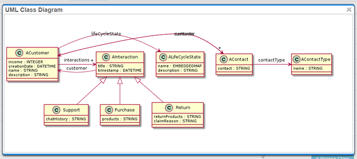

#Managing Classes

To create a class, on the schema page (*/schema*), on the *Classes* tab, click **Create**, make configuration and click **Save**.

After you create a class, you can always return to editing it by clicking its name in the list on the schema page.

##Editing Class Parameters

On the *Configuration* tab, on the *Configuration* widget, you can set class parameters:

* **Name** is the class name that will show on the schema page. Naming a class, follow the [Schema naming convention](https://github.com/OrienteerDW/Orienteer/wiki/Schema-naming-convention).
* **Short Name** is a short alias for the class name used in SQL to simplify wording.
* **Description** is a description of the class.
* **Super Classes** sets the class's parent class.
* **Over Size** is the factor that sets the extra free storage space for documents. E.g. value 2 will spare free storage space twice as large as their current space. You can use this parameter for performance optimization.
* **Strict Mode**, checking this box will prevent documents of this class from having extra properties not defined for the class.
* **Abstract**, ckecking this box makes the class abstract. This prevents the creation on documents of this class. Abstract classes are used only for derivation of other classes.
* **Java Class** is the name of the original java class from which this class was generated. For manually created classes, its value is null. 
* **Cluster Selection** defines the strategy for cluster selection (see http://orientdb.com/docs/last/Cluster-Selection.html).
* **Document Name Property** sets the property of the class, the value of which will show as the document's name in the list of documents.
* **Parent Document Property** allows you to introduce hierarchy between documents. It sets the property which refers to logical parent of a document of this class. Parent hierarchy allows for easier navigation through you data.
* **Default Tab** sets the tab that will show by default when you open a document.
* **Default Sorting** defines property used by default for sorting.
* **Default Sort Order** defines the default sorting order.

##Managing Class Properties

On the *Configuration* tab, on the *Properties* widget, you can create class properties and make their basic settings. To edit more, go to the property page by clicking its name.

On the property page, on the *Configuration* tab, you can set the following:
* **Name** and **Description** are what it says.
* **Tab**:  if you give a name for a tab here, the property will show on a separate tab.
* **Order** sets the order in which this property shows relative to other properties.
* **Type** sets the data type of the property (for the list of available data types see http://orientdb.com/docs/last/Types.html.
* **Visualization** defines the property value visualization. For the list of available visualisation types, see the [supplementary](https://orienteer.gitbooks.io/orienteer/content/supplementary_supported_visualisation_types.html).
* **Linked Class** lets you connect the class with another class.
* **Inverse** is used for link-type properties (properties containing links to other classes). It sets the property of the linked class that contains the back link.
* **Mandatory** makes this property mandatory for creating a document.
* **ReadOnly** makes this property read-only in UI on the API level.
* **UI ReadOnly** makes this property read-only in the UI.
* **Not Null** sets that value of this property can't be null.
* **Min** and **Max** defines the limits for quantifiable properties.
* **Regexp** sets a pattern for value of this property.
* **Collate** defines collate strategy. Commonly it's default or 'ci' (case insensitive).
* **Displayable** says if a property will be displayed in the list of documents of this class.
* **Hidden** hides a property from the UI.
* **Calculable** makes a property [calculable](https://orienteer.gitbooks.io/orienteer/content/adding_calculable_properties.html) (may require some experience in coding).
* **Default Value** sets the default value of the property.

On the *Configuration* tab of a class, on the *Custom properties* widget, you can add custom properties to a class.

##Managing Class Indexes

To create an index, on a class page, on the *Properties* widget, select properties that you want to be in the index and then click **Create index**. The index page will open.

After you create an index, you can always return to editing it by clicking its name on the class page, on the **Configuration** tab, on the **Indexes** widget. Alternatively, you can check them on the schema page, on the **Indexes** tab.

To learn more about indexes in OrientDB, see http://orientdb.com/docs/last/Indexes.html.

## Viewing the Data Model on a Diagram

You can view your data model on a UML diagram. On the **Scheme** page, check the classes that you want to see on the diagram and at click .

