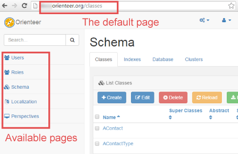
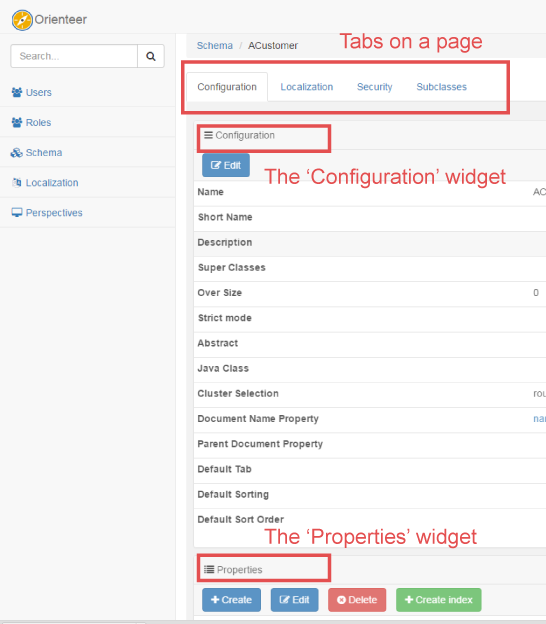

# Understanding Orienteer UI

The Orienteer UI is based on several basic concepts.

## Pages and perspectives
An Orienteer app is displayed as a set of **pages**. Some pages may be universal for all Orienteer apps, like *Users* or *Classes*. Others will be specific to particular apps. Users can access pages by clicking their links (e.g. on the navigation pane) and [via their URLs](https://orienteer.gitbooks.io/orienteer/content/special_urls.html).

A **perspective** defines what pages are available for the user on the navigation pane and what is the default page that a user sees after logging in. 

Example (the default perspective):

For each user role, the Orienteer app administrator allocates a set of available perspectives. To select another perspective, the user needs to click  on the top right.

## Tabs, dashboards and widgets

The administrator can set each page to display a given set of **tabs**, and each tab to display a particular set of **widgets**. Widgets may display a variety of data, including tables, graphs and custom widgets developed for a particular app. 

Each widget can appear in only 

Example: the default set of widgets on a page of a class includes tabs: *Configuration*, *Localization*, *Security*, *Subclasses*. The *Configuration* tab includes widgets *Configuration*, *Properties*, *Indexes*, *Custom properties*.

A widget can show 
Each widget 
widget's domains ...

## Dashboards
...